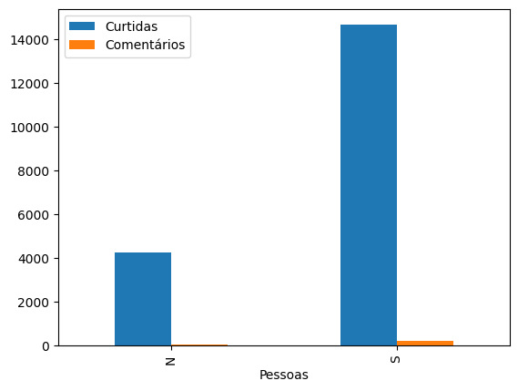
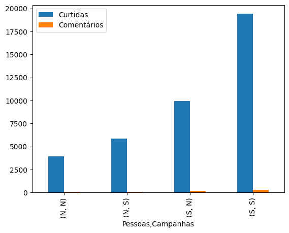
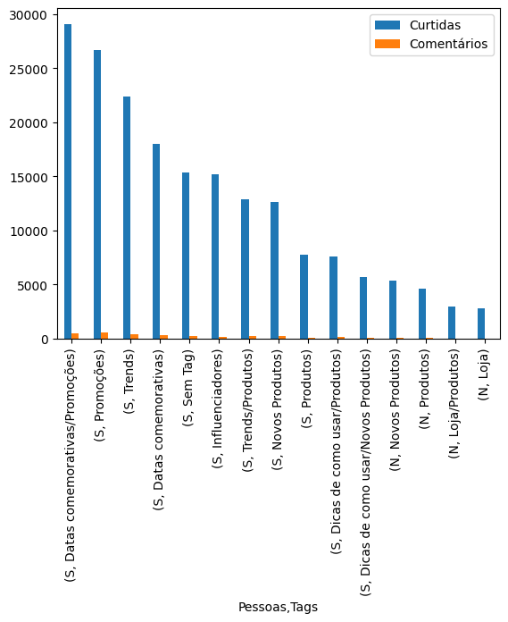

# Analisando engajamento do Instagram

Projeto de segmentação de clientes de uma base de dados do instagram utilizado em curso de Ciência de Dados ministrado por mim para a <a href="https://www.hashtagtreinamentos.com/"> Hashtag Treinamentos </a>. Foi utilizando os seguintes pacotes da liguagem Python: Pandas e Mumpy.

 
   

## Objetivos

O objetivo é segmentar a base de clientes do instagram e entender melhor suas caracteristicas de engajamento e ser mais acertivo nas publicações.

Objetivos detalhados:

 - Analise exploratoria utilizando o Pandas.
 - Saber qual o tipo de conteúdo que mais engaja no Instagram da empresa(curtidas comentários e interações)
 - Ignorar a colula de visualizaçoes e focar nas postagens com comentários, com mais e menos curtidas.
 - Tratar colunas vazias que não possuio tag
 - Apresentar uma estrutura de projeto de Ciência de Dados, utilizando notebooks, cripts, relatórios e repositório no GitHub.

   ### Analisando o engajamento de postagens de campanhas com produtos que possuen Pessoas ou Não. Entender quais campanhas geram mais curtidas e comentários.
   

   ### Analisando o engajamento de postagens de campanhas, agrupando por Pessoas e Campanhas e entender o engajamento que gera mais curtidas e comentários por tipos de postagens.
   
   
   ### Analisando o engajamento de postagens, agrupando por Pessoas e Tags e entender o engajamento que gera mais curtidas e comentários por tipos de postagens.
   
   
# Conclusões

## - Percebemos que postagens que incluia pessoas nas fotos de produtos engajam muito mais que aquelas que não possui.
## - Postagens em épocas de campanha também possuem um melhor engajamento e pode gerar um faturamento considerável.
## - Produzir fotos de qualidades é um diverencial para manter o enjamento.

